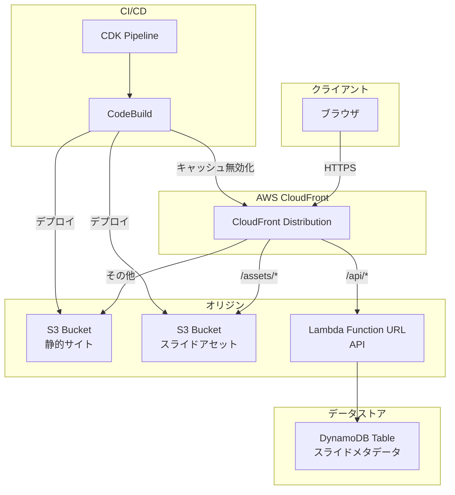
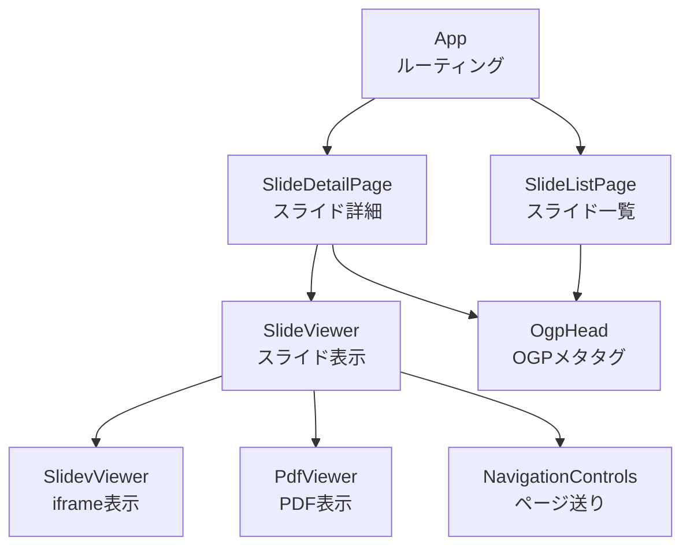
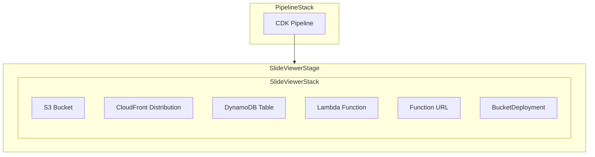

# 技術設計ドキュメント

## Overview

本ドキュメントは、個人用スライド閲覧サイト「slides.kawaaaas」の技術設計を定義する。Vite + Reactで構築した静的サイトをS3 + CloudFrontでホスティングし、DynamoDBでスライドメタデータを管理する。SlidevとPDFの両形式を統一されたUXで閲覧可能にし、OGP対応によりSNS共有時にサムネイルを表示する。

### 設計方針

- **コスト最小化**: Lambda Function URL（API Gateway不要）、DynamoDBオンデマンド、CloudFrontキャッシュ活用
- **シンプルさ**: 個人サイトとして必要十分な構成。認証・認可は不要
- **統一UX**: Speakerdeck風のページ送りUIでSlidev/PDFを同一操作で閲覧
- **自動化**: CDK Pipelineによるコード変更時の自動デプロイ

### 技術スタック

| レイヤー       | 技術                             |
| -------------- | -------------------------------- |
| フロントエンド | Vite + React + TypeScript        |
| PDF表示        | react-pdf（pdfjs-dist ラッパー） |
| Slidev表示     | iframe埋め込み                   |
| API層          | Lambda Function URL + CloudFront |
| データストア   | DynamoDB（オンデマンド）         |
| ホスティング   | S3 + CloudFront（OAC）           |
| インフラ       | AWS CDK（L2コンストラクト優先）  |
| CI/CD          | CDK Pipeline                     |
| フォーマッター | Oxfmt                            |
| リンター       | ESLint + eslint-cdk-plugin       |

## Architecture

### システム構成図



### CloudFrontビヘイビア設計

CloudFront Distributionは単一のディストリビューションで、パスパターンに基づいて3つのオリジンにルーティングする。

| パスパターン       | オリジン            | キャッシュ                  | 用途             |
| ------------------ | ------------------- | --------------------------- | ---------------- |
| `/api/*`           | Lambda Function URL | キャッシュあり（TTL: 5分）  | メタデータAPI    |
| `/assets/*`        | S3 Bucket           | キャッシュあり（TTL: 長期） | スライドアセット |
| `/*`（デフォルト） | S3 Bucket           | キャッシュあり（TTL: 短期） | 静的サイト       |

**設計判断**: API GatewayではなくLambda Function URLを採用する。理由は以下の通り。

- Lambda Function URL自体には追加料金が発生しない（Lambda実行料金のみ）
- API Gatewayの最低料金（REST API: $3.50/100万リクエスト）を回避できる
- 個人サイトでは認証・スロットリング等のAPI Gateway固有機能が不要
- CloudFrontの前段に配置することでカスタムドメインとキャッシュを利用可能

### S3バケット設計

**設計判断**: 静的サイトとスライドアセットを同一S3バケットに格納する。理由は以下の通り。

- 個人サイトでバケットを分離する複雑さのメリットがない
- BucketDeploymentで一括管理できる
- CloudFrontのOACで一元的にアクセス制御可能

バケット内のディレクトリ構造:

```
s3://slides-kawaaaas-bucket/
├── index.html              # サイトのエントリーポイント
├── assets/                 # Viteビルド成果物（JS/CSS）
├── slides/                 # スライドアセット
│   ├── {url-path}/
│   │   ├── slidev/         # Slidevビルド済みアセット（index.html等）
│   │   ├── slide.pdf       # PDFファイル
│   │   └── thumbnail.png   # OGP用サムネイル画像
│   └── ...
└── ...
```

## Components and Interfaces

### フロントエンドコンポーネント



#### コンポーネント詳細

**App**: React Routerによるルーティング。`/` で一覧、`/:urlPath` で詳細を表示。

**SlideListPage**: DynamoDB APIからスライド一覧を取得し、日付降順で表示。各項目はタイトル・日付・説明を含むカード形式。

**SlideDetailPage**: URLパスに基づいてスライドメタデータを取得し、SlideViewerとOGPメタタグを表示。

**SlideViewer**: スライド形式（slidev/pdf）に応じてSlidevViewerまたはPdfViewerを切り替え表示。NavigationControlsを共通で提供。

**SlidevViewer**: Slidevのビルド済みアセットをiframeで表示。iframeとpostMessageで通信し、ページ遷移を制御。

**PdfViewer**: react-pdf（pdfjs-distラッパー）を使用してPDFをページ単位で表示。canvasレンダリングにより1ページずつスライド形式で閲覧。

**NavigationControls**: 前へ/次へボタン、クリックエリア（左半分/右半分）、キーボード操作（←/→）を統一的に提供。最初/最後のページでボタンを無効化。

**OgpHead**: react-helmetまたはreact-helmet-asyncを使用して、動的にOGPメタタグ（og:title, og:description, og:image）をheadに挿入。

### API層

Lambda Function URLで2つのエンドポイントを提供する。単一のLambda関数でパスベースのルーティングを行う。

```typescript
// API エンドポイント
GET /api/slides          // 全スライド一覧取得（Scan、日付降順ソート）
GET /api/slides/:urlPath // 個別スライド取得（GetItem、パーティションキー指定）
```

**設計判断**: 単一Lambda関数で両エンドポイントを処理する。理由は以下の通り。

- スライド数が少ない個人サイトではScanのコストが無視できる
- Lambda関数を分割する複雑さのメリットがない
- コールドスタートを1関数分に抑えられる

### CDKスタック構成



**PipelineStack**: CDK Pipelineを定義。GitHubリポジトリへのプッシュをトリガーにself-mutatingパイプラインを構築。

**SlideViewerStack**: アプリケーションの全リソースを定義。

- S3 Bucket: 静的サイト + スライドアセット格納
- CloudFront Distribution: OAC経由でS3にアクセス、Lambda Function URLへのルーティング
- DynamoDB Table: スライドメタデータ格納
- Lambda Function + Function URL: API層
- BucketDeployment: 静的サイトとスライドアセットのデプロイ + CloudFrontキャッシュ無効化

## Data Models

### DynamoDB テーブル設計

**テーブル名**: `SlideMetadata`

| 属性名        | 型     | キー               | 説明                                  |
| ------------- | ------ | ------------------ | ------------------------------------- |
| urlPath       | String | パーティションキー | URLパス（例: `my-presentation-2024`） |
| date          | String | -                  | 日付（ISO 8601形式: `2024-01-15`）    |
| title         | String | -                  | スライドタイトル                      |
| description   | String | -                  | スライドの説明                        |
| type          | String | -                  | スライド形式（`slidev` または `pdf`） |
| s3Path        | String | -                  | S3内のアセットパス                    |
| thumbnailPath | String | -                  | OGP用サムネイル画像のS3パス           |
| totalPages    | Number | -                  | 総ページ数（Slidevの場合に使用）      |

**設計判断**: ソートキーを設定しない。理由は以下の通り。

- URLパスがユニークな識別子として十分
- 一覧取得はScan + クライアントサイドソートで対応（スライド数が少ないため）
- GSI（Global Secondary Index）を追加するとコストが増加する

**キャパシティモード**: オンデマンド（PAY_PER_REQUEST）

- 個人サイトのためアクセス頻度が低い
- プロビジョンドキャパシティの最低料金を回避

### スライドメタデータ定義ファイル

リポジトリ内にスライドメタデータをTypeScriptファイルとして定義する。デプロイ時にこのファイルからDynamoDBにデータを投入する。

```typescript
// slides/metadata.ts
export interface SlideMetadata {
  urlPath: string;
  date: string;
  title: string;
  description: string;
  type: "slidev" | "pdf";
  s3Path: string;
  thumbnailPath: string;
  totalPages?: number;
}

export const slides: SlideMetadata[] = [
  {
    urlPath: "my-presentation-2024",
    date: "2024-01-15",
    title: "発表タイトル",
    description: "発表の説明文",
    type: "slidev",
    s3Path: "slides/my-presentation-2024/slidev/",
    thumbnailPath: "slides/my-presentation-2024/thumbnail.png",
    totalPages: 20,
  },
  // ... 追加スライド
];
```

### API レスポンス型

```typescript
// 一覧取得レスポンス
interface SlideListResponse {
  slides: SlideMetadata[];
}

// 詳細取得レスポンス
interface SlideDetailResponse {
  slide: SlideMetadata;
}

// エラーレスポンス
interface ErrorResponse {
  error: string;
  message: string;
}
```

### OGPメタデータ

```html
<!-- スライド詳細ページ -->
<meta property="og:title" content="{スライドタイトル}" />
<meta property="og:description" content="{スライド説明}" />
<meta
  property="og:image"
  content="https://slides.kawaaaas/slides/{urlPath}/thumbnail.png"
/>
<meta property="og:type" content="article" />
<meta property="og:url" content="https://slides.kawaaaas/{urlPath}" />

<!-- スライド一覧ページ -->
<meta property="og:title" content="slides.kawaaaas" />
<meta property="og:description" content="スライド一覧" />
<meta property="og:type" content="website" />
<meta property="og:url" content="https://slides.kawaaaas/" />
```

**OGP対応の設計判断**: SPAではSNSクローラーがJavaScriptを実行しないため、OGPメタタグが正しく読み取られない問題がある。これに対処するため、以下のアプローチを採用する。

- **Lambda@Edge（Origin Request）** を使用して、SNSクローラー（User-Agentで判定）からのリクエストに対してOGPメタタグを含むHTMLを動的に生成して返却する
- 通常のブラウザリクエストはそのままSPAを返す
- これによりSPA構成を維持しつつ、OGPプレビューを正しく表示できる

## Error Handling

### フロントエンドエラーハンドリング

| エラー種別           | 発生条件                              | 対処                                           |
| -------------------- | ------------------------------------- | ---------------------------------------------- |
| API通信エラー        | Lambda Function URLへのリクエスト失敗 | エラーメッセージを表示し、リトライボタンを提供 |
| スライド未発見       | URLパスに対応するスライドが存在しない | 404ページを表示し、一覧ページへのリンクを提供  |
| PDF読み込みエラー    | PDFファイルの取得・パース失敗         | エラーメッセージを表示                         |
| iframe読み込みエラー | Slidevアセットの取得失敗              | エラーメッセージを表示                         |

### API層エラーハンドリング

| HTTPステータス | 条件                                  | レスポンス                                                            |
| -------------- | ------------------------------------- | --------------------------------------------------------------------- |
| 200            | 正常取得                              | スライドデータ（JSON）                                                |
| 404            | URLパスに対応するスライドが存在しない | `{ "error": "NotFound", "message": "スライドが見つかりません" }`      |
| 500            | DynamoDB接続エラー等の内部エラー      | `{ "error": "InternalError", "message": "内部エラーが発生しました" }` |

### CloudFront エラーページ

- 403/404エラー時にSPAのindex.htmlを返却（カスタムエラーレスポンス設定）
- これによりReact Routerがクライアントサイドでルーティングを処理

## Testing Strategy

### テスト方針

**プロジェクト規約（Requirement 10.3）により、本プロジェクトではテストの実装を行わない。**

プロパティベーステスト（PBT）は本機能に適用しない。理由は以下の通り。

1. **明示的な要件**: Requirement 10.3で「テストの実装を行わない」と明記されている
2. **IaC中心**: 機能の大部分がCDKによるインフラ定義であり、PBTの対象外
3. **UIレンダリング**: フロントエンドはReactコンポーネントのレンダリングが中心であり、スナップショットテストや視覚的回帰テストが適切だが、テスト実装なしの方針に従う
4. **外部サービス統合**: DynamoDB、S3、CloudFrontとの統合が中心であり、統合テストが適切だが同様にテスト実装なしの方針に従う

### 品質担保の代替手段

テストを実装しない代わりに、以下の手段でコード品質を担保する。

- **Oxfmt**: コードフォーマットの統一
- **ESLint + eslint-cdk-plugin**: 静的解析によるコード品質チェックとCDKベストプラクティスの遵守
- **CDK Pipeline**: 自動デプロイによる手動ミスの排除
- **TypeScript**: 型チェックによるコンパイル時エラー検出
- **コードレビュー**: 手動レビューによる品質確認

### リポジトリ構成

```
/
├── website/                    # フロントエンド（Vite + React）
│   ├── src/
│   │   ├── components/         # Reactコンポーネント
│   │   │   ├── SlideListPage.tsx
│   │   │   ├── SlideDetailPage.tsx
│   │   │   ├── SlideViewer.tsx
│   │   │   ├── SlidevViewer.tsx
│   │   │   ├── PdfViewer.tsx
│   │   │   ├── NavigationControls.tsx
│   │   │   └── OgpHead.tsx
│   │   ├── api/                # API呼び出し
│   │   │   └── slides.ts
│   │   ├── types/              # 型定義
│   │   │   └── slide.ts
│   │   ├── App.tsx
│   │   ├── main.tsx
│   │   └── index.css
│   ├── index.html
│   ├── vite.config.ts
│   └── package.json
├── lambda/                     # Lambda関数
│   ├── api/
│   │   └── index.ts            # スライドAPI（Function URL）
│   └── ogp/
│       └── index.ts            # OGP用Lambda@Edge
├── slides/                     # スライドアセット
│   ├── metadata.ts             # メタデータ定義
│   └── {url-path}/             # 各スライドのアセット
│       ├── slidev/             # Slidevビルド成果物
│       ├── slide.pdf           # PDFファイル
│       └── thumbnail.png       # OGPサムネイル
├── infra/                      # CDKコード
│   ├── bin/
│   │   └── app.ts              # CDKアプリエントリーポイント
│   ├── lib/
│   │   ├── pipeline-stack.ts   # CDK Pipelineスタック
│   │   ├── slide-viewer-stack.ts # アプリケーションスタック
│   │   └── slide-viewer-stage.ts # デプロイステージ
│   ├── cdk.json
│   └── package.json
├── eslint.config.mjs           # ESLint設定
└── package.json                # ルートpackage.json（ワークスペース）
```
